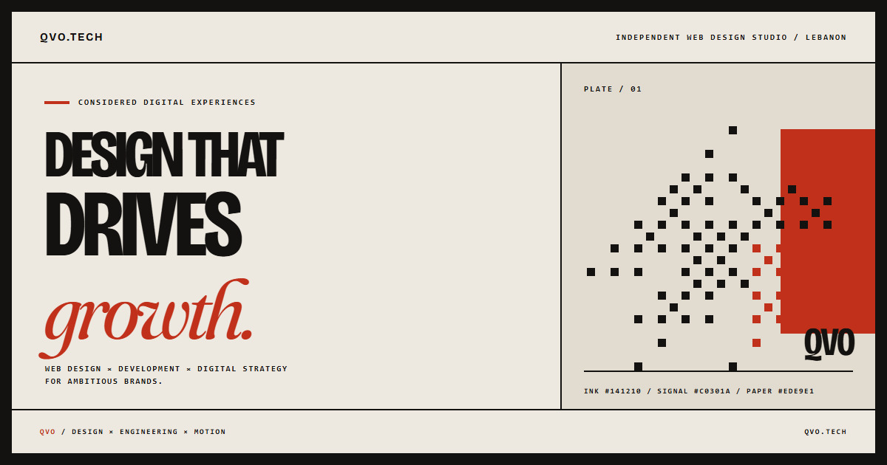

# QVO — qvo.tech



[QVO](https://qvo.tech) is a web design studio in Lebanon. This repository
contains its single-page React site and the source of the reusable
[`scroll-scrub-video`](packages/scroll-scrub-video) package.

The current site is a warm-paper, two-ink system: sharp geometry, variable type,
ruled paste-up grids and portfolio photography developed into ordered dither
plates. It does **not** use the former WebGL hero or scroll-scrubbed video
backdrop.

## Visual system

| Token | Value | Role |
| --- | --- | --- |
| `page` | `#EDE9E1` | Primary paper |
| `panel` | `#E2DCD0` | Secondary paper |
| `ink` | `#141210` | Type, rules and dark controls |
| `accent` | `#C0301A` | Signal red |
| `brand` | `#8C8375` | Muted supporting tone |

- **Display and body:** Bricolage Grotesque Variable
- **Serif emphasis:** Fraunces Variable
- **Font delivery:** exact Fontsource `5.3.0` packages, bundled by Vite; no font
  CDN sits on the critical render path
- **Geometry:** square controls, flat colour and hairline rules; no
  glassmorphism or decorative pill system

Width variants use `font-stretch`, not `font-variation-settings`, because the
latter resets every unnamed variable-font axis and would silently cancel
Tailwind's `font-weight`. `.axis-wonk` is the deliberate exception: Fraunces'
custom `SOFT` and `WONK` axes have no dedicated CSS properties, so that utility
restates every axis it needs.

The canonical tokens and font families live in
[`tailwind.config.cjs`](tailwind.config.cjs). Axis utilities and global browser
behaviour live in [`src/index.css`](src/index.css).

## What the site does

The page is assembled in [`src/App.tsx`](src/App.tsx) in this order:

1. **Hero** — the current proposition, direct contact action and selected-work
   anchor.
2. **Marquee** — a compact capability index.
3. **Work** — verified portfolio records rendered as dithered press plates.
4. **Services** — web design, web development and digital strategy.
5. **Process** — a horizontal desktop sequence that remains a normal vertical
   document on mobile and under reduced motion.
6. **Studio** — operating principles and a same-origin studio photograph,
   without invented counters or testimonials.
7. **Contact** — a direct email action.
8. **Footer** — section navigation, package link and back-to-top control.

Page-wide layers have one owner each:

- [`GlobalBackdrop.tsx`](src/components/GlobalBackdrop.tsx) draws a fixed,
  non-animated paste-up grid with CSS rules and trim marks.
- [`Navbar.tsx`](src/components/Navbar.tsx) owns desktop hide/reveal behaviour,
  the mobile menu and document locking.
- [`Preloader.tsx`](src/components/Preloader.tsx) hands its one-shot timeline to
  the hero instead of making the hero guess when to begin.
- [`Cursor.tsx`](src/components/Cursor.tsx) replaces the native cursor only for
  precise pointers and only when reduced motion is not requested.

## Dither engine

Portfolio and studio images are rendered by
[`DitheredImage.tsx`](src/components/DitheredImage.tsx) through the ordered Bayer
renderer in [`src/lib/dither.ts`](src/lib/dither.ts).

A plate enters as a coarse one-bit screen and resolves to a fine four-tone
ink-to-paper ramp as it crosses the viewport. Rendering is coalesced through one
animation frame, canvas resolution is capped at 2× device pixel ratio, and
reduced-motion visitors receive the fully developed plate immediately.

Image sources must be same-origin because the renderer reads pixels back from a
canvas. Put portfolio sources under `public/work/`; an arbitrary remote URL will
taint the canvas and block `getImageData()`.

The algorithm, tuning values, source constraints and verification checklist are
documented in [`docs/dither-engine.md`](docs/dither-engine.md).

## Motion and accessibility

- Lenis and GSAP share one ticker so smooth scrolling and ScrollTrigger do not
  drift into separate frame loops.
- `useGsapContext` scopes imperative animation and reverts it on teardown,
  including React development Strict Mode reruns.
- Split-text helpers restore the original semantic markup after one-shot
  animation instead of leaving measurement wrappers in the document.
- `prefers-reduced-motion` disables smooth scrolling, pinned horizontal motion,
  custom cursor motion and animated plate development.
- Dither canvases expose the source description with `role="img"` and
  `aria-label`.
- Work entries without a confirmed URL render as figures, not misleading links.

## Reusable package: `scroll-scrub-video`

[`packages/scroll-scrub-video`](packages/scroll-scrub-video) remains a separate
React package with no Tailwind or site-CSS dependency.

| Export | Purpose |
| --- | --- |
| `Reveal` | IntersectionObserver fade-and-lift wrapper with reduced-motion and no-observer fallbacks |
| `useScrollProgress` | Smoothed, normalised scroll progress for a container or the document |
| `ScrollScrubVideo` | Maps scroll progress onto a well-keyframed video's playhead |

The QVO site currently consumes **`Reveal` only**. `ScrollScrubVideo` is a
package API, not the site's background implementation. Package usage and
encoding guidance live in the
[package README](packages/scroll-scrub-video/README.md).

## Stack

| Layer | Choice |
| --- | --- |
| UI | React 19 |
| Language | TypeScript 7, strict mode |
| Build | Vite 8 |
| Styling | Tailwind CSS 3 + PostCSS + Autoprefixer |
| Motion | GSAP 3, ScrollTrigger and Lenis |
| Icons | lucide-react |
| Fonts | Bricolage Grotesque Variable and Fraunces Variable via Fontsource |
| Workspace package build | tsup + TypeScript declarations |

## Getting started

### Prerequisites

- Node.js **20.19 or newer** — Vite 8 does not run on Node 18
- npm with lockfile support

### Install and run

```bash
git clone https://github.com/hanibrahim130-boop/qvo.tech.git
cd qvo.tech
npm ci
npm run dev
```

The development server listens on `http://localhost:5199` and is exposed to the
local network by [`vite.config.ts`](vite.config.ts).

### Commands

| Command | Purpose |
| --- | --- |
| `npm run dev` | Start Vite with hot module replacement |
| `npm run build` | Type-check the site, then write the production bundle to `dist/` |
| `npm run preview` | Serve the built site for a production smoke test |
| `npm run build -w scroll-scrub-video` | Build the package's ESM, CJS and declaration outputs |

Before any commit, run the same clean-install sequence as CI:

```bash
npm ci && npm run build && npm run build -w scroll-scrub-video
```

`package.json` and `package-lock.json` must move together. Use npm commands to
change dependencies; do not hand-edit one manifest without regenerating the
other.

## Repository map

```text
.
├── index.html                         # SEO, social metadata, JSON-LD, font preloads
├── public/
│   ├── qvo-share.jpg                  # 1200×630 Open Graph/Twitter image
│   ├── studio-portrait.webp           # Same-origin studio plate source
│   └── work/*.webp                    # Same-origin portfolio plate sources
├── docs/
│   └── dither-engine.md               # Bayer pipeline and image constraints
├── src/
│   ├── App.tsx                        # Page composition and global orchestration
│   ├── index.css                      # Font imports, axis utilities and global CSS
│   ├── components/
│   │   ├── GlobalBackdrop.tsx         # Static paper grid
│   │   ├── DitheredImage.tsx          # Scroll-aware canvas plate
│   │   ├── Work.tsx                   # Verified portfolio data and rendering
│   │   └── …                          # Page sections and interaction primitives
│   └── lib/
│       ├── dither.ts                  # Ordered 8×8 Bayer renderer
│       ├── gsap.ts                    # Scoped GSAP integration
│       ├── splitText.ts               # Reversible text measurement wrappers
│       ├── useLenis.ts                # Shared scroll clock and navigation helper
│       └── usePrefersReducedMotion.ts # Reactive and imperative motion policy
├── packages/
│   └── scroll-scrub-video/            # Independent React motion package
├── tailwind.config.cjs                # Design tokens and font families
└── package.json                       # Root app and npm workspace
```

## Editing safely

- **Portfolio:** edit the typed records in `src/components/Work.tsx` and keep
  image files under `public/work/`. Do not add a result, date, testimonial or
  destination unless it can be sourced.
- **Dither treatment:** change shared values in `DitheredImage.tsx` or the
  renderer in `src/lib/dither.ts`; do not tune each client into a different
  visual effect.
- **Background:** `GlobalBackdrop.tsx` is a static page ground. It has no media
  URL, decoder or scroll progress.
- **Metadata:** title, descriptions, Open Graph, Twitter, JSON-LD and font
  preloads are in `index.html`. All three social-image references point to
  `public/qvo-share.jpg`.
- **Typography:** preserve `font-stretch` for width. Do not collapse variable
  axes into one `font-variation-settings` declaration.
- **Content integrity:** never invent clients, testimonials, statistics, awards
  or dates. If a claim has no source, remove it rather than styling around it.

## Deployment

`npm run build` produces a static site in `dist/`. Before deployment, serve that
folder with `npm run preview`, verify the social image resolves, scroll every
plate through its coarse and fine states, and check reduced motion.

## Contributing

See [`CONTRIBUTING.md`](CONTRIBUTING.md). Keep changes focused, explain why they
exist, and include visual evidence for visual work.

## License

MIT — see [`LICENSE`](LICENSE).

## Contact

- Site: [qvo.tech](https://qvo.tech)
- Email: [hello@qvo.tech](mailto:hello@qvo.tech)
